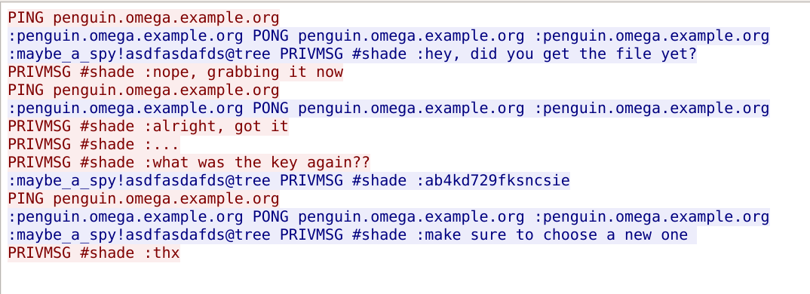

# A Real Packet in my CAP

## Forensics - 200 points

### Description

A lot of interesting information is flying over the network! What can you
extract?

### Hints

- Start by looking through the packet capture for communcation streams
- There's more than one interesting stream in this pcap...
- Once you've found the first item of interest, keep looking until you find
  what to do with it!

### Solution

This challenge presents a packet capture file containing a variety of traffic.
The first step that I typically take with network forensic challenges is to
open the packet capture in [Wireshark](www.wireshark.org). I then select
`Statistics` -> `Protocol Hierarchy` from the menu. This gives a high-level
overview of the different types of protocols in the pcap so I can see if there
is anything unique or out of the ordinary from other similar network forensic
challenges. I immediately notice that there is IRC traffic. Given that this is
a CTF, I hone in on this traffic by filtering for only IRC traffic in
Wireshark. By following the TCP stream, we see a conversation between two
parties.

So we have a key for a file, but we don't know which file the key unlocks! The
next step naturally is to find the file of interest. Going back into the
